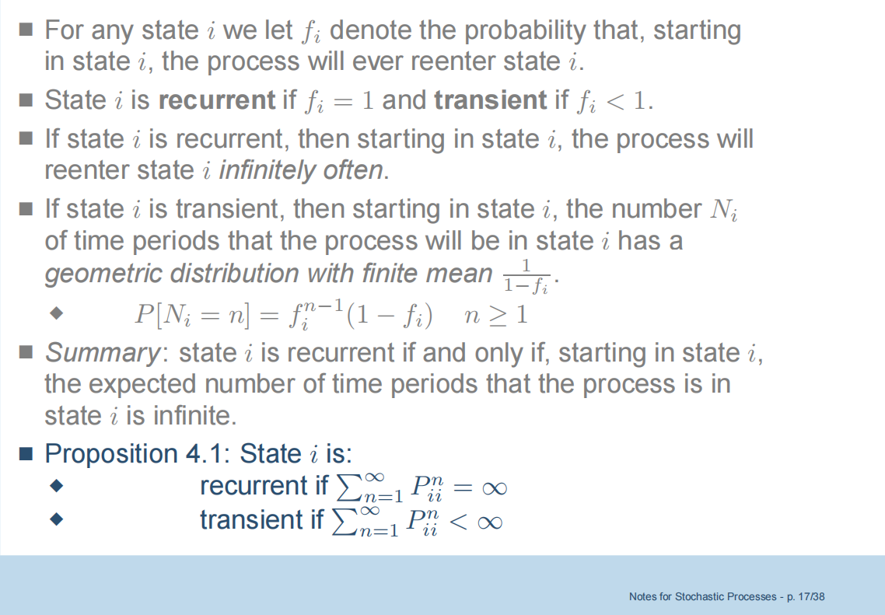

# 1 离散时间马尔可夫链

这一章可参考大三上《随机过程》一课Ch4的课件

## 1.1 Introduction

上下文与背景

- **离散时间马尔可夫链**：指的是在离散时间点上进行的随机过程，状态空间是有限的或可列无限。
- **可测空间**：$(\Omega, \mathscr{F}, \mathbb{P})$是一个概率空间，其中\(\Omega\)是样本空间，\(\mathscr{F}\)是\(\sigma\)-代数，\(\mathbb{P}\)是概率测度。
- **状态空间 \(S\)**：是有限或可数无限的集合，常用于表示系统的所有可能状态。

随机变量与状态空间

- **随机变量**：$x: \Omega \rightarrow S$是一个随机变量，当且仅当对于每个状态 $s \in S$，集合 $\{x = s\}$ 是可测的，即属于$\mathscr{F}$。
- **状态空间示例**：
  - 有限状态空间：\(S = \{1, 2, \ldots, N\}\)
  - 无限状态空间：如自然数集 \(\mathbb{N}\)、整数集 \(\mathbb{Z}\)、非负整数集 \(\mathbb{Z}_{+}\)、以及二维整数网格 \(\mathbb{Z}^2\)。

马尔可夫链的定义

- **马尔可夫链**：是一个离散时间随机过程
  $$
  X = \left(X_n: \Omega \rightarrow S \mid n = 0, 1, 2, \ldots\right)
  $$
  满足马尔可夫性质。

- **马尔可夫性质**（Markov Property）：
  - 条件概率关系：
    $$
    \mathbb{P}\left\{X_n = j \mid X_{n_1} = i_1, \ldots, X_{n_k} = i_k\right\} = \mathbb{P}\left\{X_n = j \mid X_{n_k} = i_k\right\}
    $$
  - 表示在给定当前状态 $i_k$ 的情况下，未来状态 $X_n$ 取值 $j$ 的概率与过去的状态无关，只依赖于当前状态。
  - **解释**：这体现了马尔可夫链的核心思想：“未来”只依赖于“现在”而与“过去”无关。所有可能的过去的影响都浓缩在当前的状态中。

$l$ 步转移概率的计算类似于链式法则

We notice here that in (1.1.2), it is understood that if $p_{k_1 k_2}^{(n+1,+1)}$ is undefined, that is, $\mathbb{P}\left\{X_{n+1}=\right.$ $\left.k_1\right\}=0$, the corresponding summand $p_{i k_1}^{(n,+1)} p_{k_1 k_2}^{(n+1,+1)} \cdots p_{k_{\ell-1} j}^{(n+\ell-1,+1)}$ is to be taken as 0 ; we observe that, for such a value of $k_1, p_{i k_1}^{(n,+1)}=0$; similar for other $k$.
- In many important cases $P^{(n,+\ell)}$ is independent of $n$ so that we simply write $P^{(\ell)}=\left[p_{i j}^{(\ell)}\right]$ for $P^{(n,+\ell)}=\left[p_{i j}^{(n,+\ell)}\right]$ and speak of "time-homogeneous" transition probability matrix. In this case, simply write $P=P^{(1)}$ so that the following "Chapman-Kolmogorov equation" holds:

$$
P^{(\ell)}=P^{\ell} \quad \text { and } \quad P^{(m+n)}=P^m P^n
$$

for any $\ell \geq 1$ and $m, n \geq 1$.

时间齐次：转移概率与起始点无关，只与转移的步数有关。比如，我从t=0时的i转移到t=10的j，和从t=100时的i转移到t=110时的j的概率是一样的。

由于假设了时间齐次性，$P^{(l)}$ 表示 $l$ 步转移矩阵

In practice matrices $P^{(n,+1)}=\left[p_{i j}^{(n,+1)}\right]$ are given, satisfying (1.1.1), and then a Markov chain may be defined which has these matrices as transition probability matrix using Kolmogoroff's extension theorem (Theorem 0.5.4). This process is defined by choosing initial probabilities ${ }^2$
$$
p_i=\mathbb{P}\left\{X_0=i\right\} \quad \forall i \in S
$$

and defining finite-dimensional distributions

$$
\mathbb{P}\left\{X_0=i_0, X_1=i_1, \ldots, X_n=i_n\right\}=p_{i_0} p_{i_0 i_1}^{(0,+1)} \cdots p_{i_{n-1} i_n}^{(n-1,+1)} \quad \forall i_0, \ldots, i_n \in S
$$

for all $n \geq 1$. Therefore if $X=\left(X_n\right)_{n \geq 0}$ is a Markov chain (time-homogeneous) then the distribution $\mathbb{P}_{X_n}$ of $X_n$ is such that

$$
\mathbb{P}_{X_n}(\{k\})=\mathbb{P}\left\{X_n=k\right\}\left(=\sum_{j \in S} p_j P_{j k}^{(0,+n)}\right)=\sum_{j \in S} p_j P_{j k}^n \quad \forall k \in S
$$

### 1.1.2 Examples

独立同分布比马尔可夫性更强

### 1.1.3 Classification of states of Markov chains

#### Communication of two states

参考《随机过程》课件

- Accessible: State $j$ is said to be accessible from state $i$ iff $P_{i j}^n>0$ for some $n \geq 0$, and we write $i \rightarrow j$.
- Communicate: Two states $i$ and $j$ that are accessible to each other are said to communicate, and we write $i \leftrightarrow j$.
- Note: $P_{i i}^0=1 \Rightarrow$ Any state communicates with itself.
- Tree properties of the relation of communication:

  - (i) State $i$ communicates with state $i$, all $i \geq 0$; $i \leftrightarrow i \quad$ Reflexive
  - (ii) If state $i$ communicates with state $j$, then state $j$ communicates with state $i$;

  $$
  i \leftrightarrow j \Rightarrow j \leftrightarrow i \quad \text { Symmetric }
  $$

    - (iii) If state $i$ communicates with state $j$, and state $j$ communicates with state $k$, then state $i$ communicates with state $k$.

$$
i \leftrightarrow j, j \leftrightarrow k \Rightarrow i \leftrightarrow k \quad \text { Transitive }
$$

#### 不可约 Irreducibility

#### 周期 pe'r

关于周期的三个重要性质：

1.1.5 Theorem. For each state $i$ with $d_i<\infty$, there is some natural number $N$ depending on $i$ such that $p_{i i}^{\left(n d_i\right)}>0$ for all $n \geq N$.
Proof. Exercise!
This asserts that a return to state $i$ can occur at all sufficiently large multiples of the period $d_i$. The following theorem shows that the period is a constant in each class of communicating states.
1.1.6 Theorem. If $i$ ins $j$ then $d_i=d_j$.

Proof. (Exercise) As $p_{j j}^{\left(n d_j\right)}>0$ for sufficiently big $n$ and $\exists m_1, m_2>0$ so that $p_{i j}^{\left(m_1\right)}>0$ and $p_{j i}^{\left(m_2\right)}>0$, it follows that $d_i\left|m_1+m_2, d_i\right| m_1+n d_j+m_2$, and so $d_i \mid d_j$. Switching the roles of $i$ and $j$, it holds that $d_j \mid d_i$. Thus $d_i=d_j$.

$$
\text { If } d_i<\infty \text {, is } p_{i i}^{\left(d_i\right)}>0 \text { ? }(\times ; \text { cf. Footnote } 4)
$$

1.1.7 Corollary. If $p_{i j}^{(m)}>0$ and $d_j<\infty$, then $p_{i j}^{\left(m+n d_j\right)}>0$ for all $n$ sufficiently large.

Proof. Exercise!
A Markov chain in which each state has period one is called aperiodic. The vast majority of Markov chains we deal with are aperiodic. For an interesting property of period, see Lemma 1.3.9 in $\S 1.3$.

- **Class（类）**: Two states that communicate are said to be in the same *class*. 
  - *Note*: Any two classes of states are either identical or disjoint.

- **Irreducible（不可约）**: The Markov chain is said to be *irreducible* if there is only one class, that is, if all states communicate with each other.

## 1.2 常返态和非常返态

1.2.1 Theorem. The state $i$ is recurrent iff $\sum_{n=1}^{+\infty} p_{i i}^{(n)}=\infty$. Here $P^n=\left[p_{j k}^{(n)}\right]$ is the $n$-steps transition matrix.

1.2.2 Corollary (0-1 law). The state $i$ is recurrent iff $\mathbb{P}\left\{\exists n_k \nearrow+\infty\right.$ s.t. $\left.X_{n_k}=i \mid X_0=i\right\}>0$. That is, $\mathbb{P}\left(X_n=i\right.$ i.o. $\left.\mid X_0=i\right)>0$ iff $\mathbb{P}\left(X_n=i\right.$ i.o. $\left.\mid X_0=i\right)=1$.

如果i是一个暂态，那么对于几乎所有的 $\omega \in \Omega$ （即在概率测度P下，除了一个概率为0的集合外，对所有的样本路径 $\omega$ 都成立），它们对应的随机过程都最终会永远地离开状态i。也就是说，$\mathbb{P}\left(X_n=i\right.$ i.o. $\left.\mid X_0=i\right)$ 其实是一个对 $\omega$ 的概率，表示使得 $X_n=i$ 出现无穷多次的 $\omega$ 出现的概率。 如果这个概率大于0，那它只能是1，而不可能是0到1之间的某个数。也就是说这个概率要么是0（暂态），要么是1（常返态）。

**First visiting instant（首次访问时间）**
Given any state $j \in S$, define random variable $T_j: \Omega \rightarrow\{1,2, \ldots\} \cup\{\infty\}$ by
$$
T_j(\omega)= \begin{cases}\min \left\{n \geq 1: X_n(\omega)=j\right\} & \text { if } \exists n \geq 1 \text { s.t. } X_n(\omega)=j \\ \infty & \text { if } X_n(\omega) \neq j \forall n \geq 1\end{cases}
$$

Since $\left\{X_1 \neq j, \ldots, X_{n-1} \neq j, X_n=j\right\}=\left\{T_j=n\right\} \forall n \geq 1$, so $T_j \in \mathscr{F}$. Of course $X_{T_j} \equiv j$.
Define
$$
f_{i j}^{(m)}=\mathbb{P}\left\{T_j=m \mid X_0=i\right\} \forall m \geq 1 \quad \text { and } \quad f_{i j}^*=\sum_{m=1}^{\infty} f_{i j}^{(m)} \quad\left(0 \leq f_{i i}^* \leq 1\right)
$$

Then $f_{i j}^*$ is just the probability of, starting from $i$, visiting $j$ after some finite-length of time.

$T_j$ 表示第一次到达状态 $j$ 的时间，即$\left\{X_1 \neq j, \ldots, X_{n-1} \neq j, X_n=j\right\}=\left\{T_j=n\right\}$；

$f_{i j}^{(m)}$ 表示从状态 $i$ 开始，经过 $m$ 步第一次到达状态 $j$ 的概率； 

 $f_{i j}^*$ 表示从状态 $i$ 开始，在有限时间内到达状态 $j$ 的概率

1.2.3 Exercise. Let $X=\left(X_n\right)_{n \geq 0}$ be an irreducible Markov chain with state space $S=\{1, \ldots, N\}$, where $2 \leq N<\infty$. Prove the following two statements:
(1) There exist two constants $C>0$ and $0<\rho<1$ such that
$$
\mathbb{P}\left\{T_j>n \mid X_0=i\right\} \leq C \rho^n \quad \forall 1 \leq i, j \leq N \text { and } n \geq 1
$$

(2) $m_{i j}:=\mathrm{E}_{\mathbb{P}\left(\cdot \mid X_0=i\right)}\left[T_j\right]<\infty .^8$

Thus $X$ is "positive recurrent" (cf. Corollary 1.3.10).

1.2.4 Exercise. Prove that:
(1) $f_{i i}^{(n)}=\mathbb{P}\left\{X_{m+n}=i, X_{m+k} \neq i, 1 \leq k<n \mid X_m=i\right\}$ for any $n \geq 2$.
(2) $f_{i i}^{(n)}=\sum_{i_1 \neq i, \ldots, i_{n-1} \neq i} p_{i i_1} \cdots p_{i_{n-1} i}$ for any $n \geq 2$.

为了证明定理1.2.1，我们需要引理1.2.5和1.2.6：

1.2.5 Lemma. The state $i$ is recurrent iff $f_{i i}^*=1$.

Proof. Since $\left\{\exists n_k \nearrow \infty\right.$ s.t. $\left.X_{n_k}=i\right\} \subseteq \sum_{m=1}^{\infty}\left\{T_i=m\right\}$, so if $i$ is recurrent, then $f_{i i}^*=1$. Conversely, assume $f_{i i}^*=1$. To show $i$ is recurrent, suppose to the contrary that $i$ is non-recurrent. Then $\exists N \geq 0$ such that $\mathbb{P}\left\{X_N=i\right.$ and $\left.X_{N+\ell} \neq i \forall \ell \geq 1 \mid X_0=i\right\}>0$; and then from Markov property and time-homogeneity, it follows that $\mathbb{P}\left\{X_{\ell} \neq i \forall \ell \geq 1 \mid X_0=i\right\}>0$. So $f_{i i}^*<1$, a contradiction. This thus proves the lemma.

这个引理是说，常返态一定会在有限的时间内返回自身。引理1.2.5也经常被用作常返态的定义。

1.2.6 Lemma. Given any two states $i, j \in S$,

$$
p_{i j}^{(n)}=\sum_{m=1}^n f_{i j}^{(m)} p_{j j}^{(n-m)}
$$

for all $n \geq 1$.
Proof. (Exercise) This follows from that

$$
\begin{aligned}
p_{i j}^{(n)} & =\mathbb{P}\left(X_n=j \mid X_0=i\right) \\
& =\mathbb{P}\left(X_1=j, X_n=j \mid X_0=i\right)+ \\
& \mathbb{P}\left(X_1 \neq j, X_2=j, X_n=j \mid X_0=i\right)+\cdots+\mathbb{P}\left(X_1 \neq j, \ldots, X_{n-1} \neq j, X_n=j \mid X_0=i\right) \\
= & \sum_{m=1}^n f_{i j}^{(m)} p_{j j}^{(n-m)}
\end{aligned}
$$

where $p_{j j}^{(0)}=1$.
