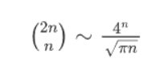
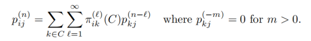

## 一、关于例子
主要是两种例子，successful runs(Tom and Jerry) 和random walk(gambler’s ruin)

### 1.1.2 Examples(P37)

### 1.2.3 Examples of recurrent Markov chains(P47)

- 1D/2D/3D random walk

进一步还有

- Tom and Jerry

### 1.3.3 Examples(P61)
- Success runs (Tom and Jerry)
- random walk with a reflection state

### 1.4.2 Examples(P65)
the gambler’s ruin
A. Next, we first consider the example of the gambler’s ruin on n + 1 states, S = {0, 1, . . . , n},
B. We secondly consider the gambler’s ruin with an infinitely rich adversary (opponent), i.e., S = Z+.

### 1.5.2 Examples(P70)
a) Random walk on Z+ with a reflection state 0
b) Random walk on Z+ without reflection state
c) A discrete queuing Markov chain with state space Z+

## 二、关于定理证明

### 1.3

Thm1.3.3 核心是利用Lemma1.2.6和Thm1.3.2，然后分i=j和i!=j讨论

Thm1.3.6 证明存在性的核心是利用 $\pi \geq \pi P$

Thm1.3.8 由positive recurrent可以推出pi=pi*Pd（但好像没啥用）。利用P(nd+1)=Pnd*P=P*Pnd，得到两个等式，然后由Lemma1.3.9可以得到极限情况，再用Fatou引理得到pi>=pi*P，最后证明严格大于不成立

Lemma1.3.9 (1)主要是证明不交并；(2)利用Thm1.1.5

Thm1.3.10 见hw2，证明简单

Thm1.3.11  i走md+r步到j，j再走(n-m)d步到j。证明较简单

Thm1.3.13 利用Thm1.3.11，证明有点技巧。

Thm1.3.14 直接用Thm1.3.11（令d=1,r=0即可），证明简单。

### 1.4

Thm1.4.2 定义 $π_{ik}(C)$ 和 $π_{ik}^{(l)} (C)$，则 $\pi_i (C)=\sum_{k \in C} \pi_{ik}(C)$ 。然后利用

### 1.5

Lemma1.5.1 见hw4，证明较为简单

Thm1.5.2 （nonrecurrent $\rightarrow$ 有解）$y_0=1, y_i=f_{i0}^*$，由nonrecurrent可以推出nonconstant，由 $f_{ij}^* = p_{ij} + \sum_{k \neq j} p_{ik}f_{kj}^*$ 可以推出满足方程

（有解 $\rightarrow$ nonrecurrent）定义 $\tilde{P}$ ，（反证）假设P常返，则 $f_{i0}^*=1$，从而由prop1.3.14可以推出 $\lim_{n \rightarrow \infty} \tilde{p}_{i0}^{(n)} = 1 $ ，然后把 $\sum \tilde{p}_{ij}^{(n)}y_j $分成 $j=0$ 和 $j \neq 0$ 两部分，令n趋向无穷就可以得到 $y_i=y_0$，即constant，矛盾

Thm1.5.4

（有解 $\rightarrow$ recurrent）由方程出发，令m趋向无穷

（recurrent $\rightarrow$ 有解）定义 $\tilde{\eta}_i(n)$ ，对于任何给定的 $i$ ，取 $n_{i,k}$ ，使得 $\tilde{\eta}_i(n_{i,k}) < 2^{-k}$ ，令解为 $y_i= \sum_{k \geq 1} \tilde{\eta}_i(n_{k,k})$，由Fatou引理可以证明当i趋向无穷时，$y_i \rightarrow \infty$ 。另一方面，$\tilde{\eta}_i(n) \geq \sum_{j} \tilde{p}_{ij} \tilde{\eta}_j(n)$，从而 $y_i= \sum_{k \geq 1} \tilde{\eta}_i(n_{k,k}) \geq \sum_{j \geq 0} \tilde{p}_{ij} y_j = \sum_{j \geq 0} p_{ij} y_j \quad (i \neq 0)$

一些重要公式：

- Lemma1.2.6

- 关于$f_{ij}^*$ 的：

$$
f_{ij}^* = p_{ij} + \sum_{k \neq j} p_{ik}f_{kj}^*
$$

