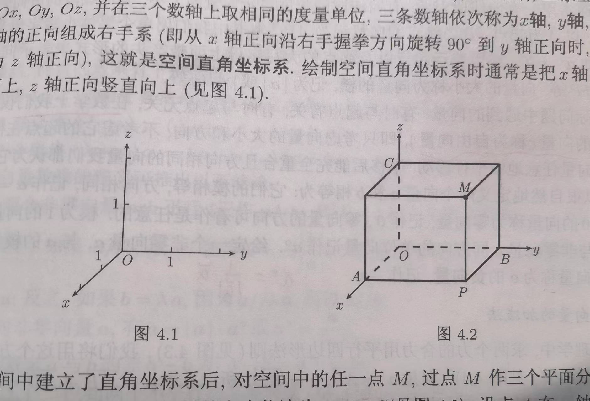
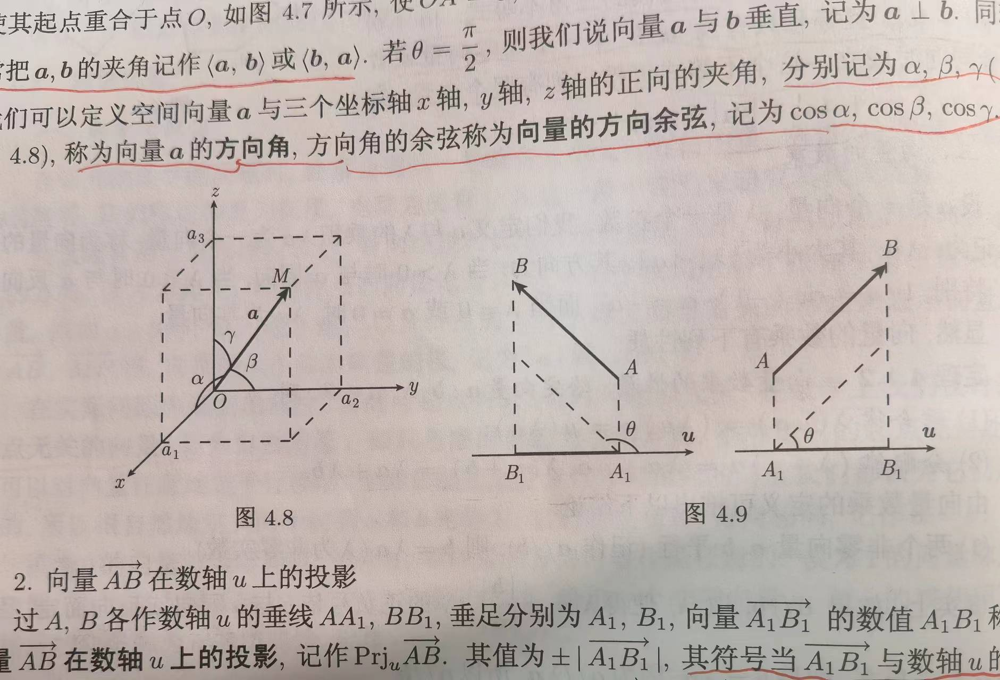
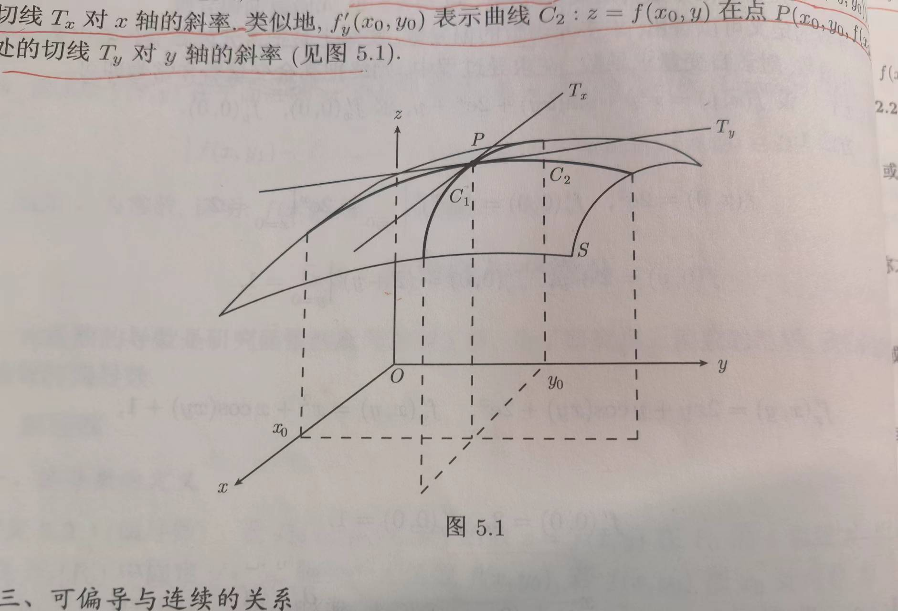

## 第一章

### 1.2 极限

#### 1.2.1 数列极限

定义 1.2.4 (数列极限). 设 $\left\{a_n\right\}$ 为数列, $A \in \mathbb{R}$. 如果任给 $\varepsilon>0$, 都存在正整数 $N=N(\varepsilon)$, 使得当 $n>N$ 时, 有
$$
\left|a_n-A\right|<\varepsilon,
$$

则称 $\left\{a_n\right\}$ 以 $A$ 为极限, 或称 $\left\{a_n\right\}$ 收敛于 $A$, 记为
$$
\lim _{n \rightarrow \infty} a_n=A \text { 或 } a_n \rightarrow A(n \rightarrow \infty) .
$$

定义 1.2.5 (子数列) 设有数列 $\left\{x_n\right\}$, 从 $\left\{x_n\right\}$ 中抽出无穷多项, 按其在原数列中的先后次序排成的新数列，称为 $\left\{x_n\right\}$ 的子数列，记为  $\left\{x_{n_k}\right\}$ ，其中 $x_{n_k}$ 是原数列的第 $n_k$ 项。

例如数列 $\left\{x_n\right\}=\left\{(-1)^{n-1}\right\}$, 而 $\left\{x_{2 n-1}\right\}: 1,1,1, \cdots ;\left\{x_{2 n}\right\}:-1,-1,-1, \cdots$ 就是它的两个子数列. 很显然，一个数列可以有无穷多的子数列，那么它们在极限的存在性方面有何关系呢? 下面的定理回答了这一问题.
定理 1.2.6 设 $\lim _{n \rightarrow \infty} x_n=A$ ( $A$ 为有限数), $\left\{x_{n_k}\right\}$ 为 $\left\{x_n\right\}$ 的任意一个子数列, 则
$$
\lim _{k \rightarrow \infty} x_{n_k}=A \text {. }
$$

证明 由于 $\lim _{n \rightarrow \infty} x_n=A$, 则 $\forall \varepsilon>0, \exists N \in \mathbb{N}$, 当 $n>N$ 时, 有 $\left|x_n-A\right|<\varepsilon$. 于是对于 $\left\{x_n\right\}$ 的任意一个字数列 $\left\{x_{n_k}\right\}$, 当 $k>N$ 时, 总有 $n_k \geqslant k>N$, 所以有 $\left|x_{n_k}-A\right|<\varepsilon$,即 $\lim _{k \rightarrow \infty} x_{n_k}=A$.

注 由于 $\left\{x_n\right\}$ 本身就是 $\left\{x_n\right\}$ 的一个子数列, 故此定理的逆命题也成立, 即若数列 $\left\{x_n\right\}$的任何一个子数列都收敛于常数 $A$, 则数列 $\left\{x_n\right\}$ 也收玫于常数 $A$.
$n$ 由此定理, 立即可得

推论 1.2.7 若某数列有两个取不同极限的子数列, 那么该数列必发散.

前面我们在定义 1.2 .4 中已经给出了发散数列的定义. 下面我们用 $\varepsilon-N$ 语言给出数列 $\left\{x_n\right\}$ 不以: $A$​​ 为极限的定义.

定义 1.2.6 $\left(x_n \nrightarrow A(n \rightarrow \infty)\right)$ 设数列为 $\left\{x_n\right\}, A \in \mathbb{R}$, 若存在 $\varepsilon_0>0$, 对于任意的 $N \in \mathbb{N}$, 存在 $n_0>N$, 使得 $\left|x_{n_0}-A\right| \geqslant \varepsilon_0$, 则称数列 $\left\{x_n\right\}$ 不以 $A$ 为极限. 记为 $x_n \nrightarrow$ $A(n \rightarrow \infty)$.

#### 1.2.2 函数极限

设 $x_0 \in \mathbb{R}, \delta>0$. 我们将开区间 $\left(x_0+\delta, x_0+\delta\right)$ 称为 $x_0$ 的一个开邻域, 两个开区间之并 $\left(x_0-\delta, x_0\right) \cup\left(x_0, x_0+\delta\right)$ 称为 $x_0$ 的一个去心开邻域或空心开邻域.

定义 1.2.8. 设函数 $f(x)$ 在点 $x_0$ 的一个空心开邻域 $\left(x_0-\delta_0, x_0\right) \cup\left(x_0, x_0+\delta_0\right)$中有定义. 如果存在 $A \in \mathbb{R}$, 使得对任意给定的 $\varepsilon>0$, 都存在 $0<\delta<\delta_0$, 当 $0<\left|x-x_0\right|<\delta$ 时, 有
$$
|f(x)-A|<\varepsilon,
$$

则称函数 $f(x)$ 在 $x_0$ 处 (当 $x$ 趋于 $x_0$ 时) 有极限 $A$, 记为
$$
\lim _{x \rightarrow x_0} f(x)=A \text { 或 } f(x) \rightarrow A\left(x \rightarrow x_0\right) .
$$

需要注意的是, $f$ 在 $x_0$ 处的极限与 $f$ 在 $x_0$ 处的值没有直接关系, $f$ 甚至可以在 $x_0$​ 处没有定义.

定理 1.2.14 (海涅定理). 设函数 $f$ 在 $x_0$ 的一个空心开邻域内有定义, 则 $f$ 在 $x_0$处的极限为 $A$ 当且仅当对任何收敛点列 $x_n \rightarrow x_0(n \rightarrow \infty)$ 且 $x_n \neq x_0(\forall n)$, 均有
$$
\lim _{n \rightarrow \infty} f\left(x_n\right)=A .
$$

### 1.3 连续函数

#### 1.3.1 连续函数的定义

定义 1.3.1 (点连续) 设函数 $f(x)$ 在点 $x_0$ 的某一邻域 $N\left(x_0\right)$ 上有定义, 若
$$
\lim _{x \rightarrow x_0} f(x)=f\left(x_0\right),
$$

也即对于任意的 $\varepsilon>0$, 存在 $\delta>0$, 当 $\left|x-x_0\right|<\delta$ 时, 恒有
$$
\left|f(x)-f\left(x_0\right)\right|<\varepsilon .
$$

则我们就称函数 $f(x)$​ 在点 $x_0$​ 处连续.

此外，以函数极限的数列语言定义（海涅定理）还可以这样来描述. 若对任意选取的数列 $\left\{x_n\right\}, x_n \in$ $N\left(x_0\right)$, 且 $x_n \rightarrow x_0$, 均有 $\lim _{n \rightarrow \infty} f\left(x_n\right)=f\left(x_0\right)$, 则我们称函数 $f(x)$ 在点 $x_0$ 处连续.

定义 1.3.2 (左、右连续) 设 $x_0 \in \mathbb{R}, \delta>0, U=\left[x_0, x_0+\delta\right)\left(\right.$ 或 $\left.\left(x_0-\delta, x_0\right]\right)$, 函数 $f(x)$ 在 $U$ 中有定义, 若 $\lim _{x \rightarrow x_0^{+}} f(x)=f\left(x_0\right)$ (或 $\lim _{x \rightarrow x_0^{-}} f(x)=f\left(x_0\right)$ ). 则我们称函数 $f(x)$ 在点 $x_0$ 右连续 (或左连续).

函数在一点处的左连续和右连续统称为单侧连续. 由于函数的连续性是用极限来定义的, 因此由定理 1.2.8 立即就有函数 $f(x)$ 在点 $x_0$ 处连续与它在该点的单侧连续之间的关系.

定理 1.3.1 函数 $f(x)$ 在点 $x_0$ 处连续的充分必要条件是 $f(x)$ 在点 $x_0$ 处既左连续又右连续.

定义 1.3.3 (连续函数) 设函数 $f(x)$ 在一个开区间 $I$ 上有定义, Continuous 每一点都连续, 则称函数 $f(x)$ 为区间 $I$ 上的连续函数. 议 $f(x) \in C I ， f(x) \in C(I)$
(注 当区间 $I$ 包含端点时, 函数 $f(x)$ 在 $I$ 内连续, 在左端点处右连续, 在右端点处左连续, 则称函数 $f(x)$ 在此闭区间 $I$ 上连续. 记 $力 f(x) \in C[a, b]$.

连续函数：任给 $\varepsilon>0$, 存在 $\delta>0$, 当 $\left|y-x\right|<\delta$​ 时, 有
$$
\left|f(y)-f(x)\right|<\varepsilon
$$

$$

$$

#### 1.3.2 连续函数的运算法则

定理 1.3.8 设 $f(u)$ 在点 $b$ 连续, 若 $\lim _{x \rightarrow x_0} g(x)=b\left(x_0\right.$ 为有限或 $\left.\pm \infty\right)$, 则
$$
\lim _{x \rightarrow x_0} f(g(x))=f\left(\lim _{x \rightarrow x_0} g(x)\right)=f(b) .
$$

证明：我们仅对 $x_0$ 为有限数给出证明. 因 $f(u)$ 在点 $b$ 连续, 于是 $\forall \varepsilon>0, \exists \delta>0$, 当 $\mid u-$ $b \mid<\delta$ 时, 恒有 $|f(u)-f(b)|<\varepsilon$.

令 $u=g(x)$, 对上述的 $\delta>0$, 因为 $\lim _{x \rightarrow x_0} g(x)=b$, 故 $\exists \eta>0$, 当 $0<\left|x-x_0\right|<\eta$ 时, 恒有 $|g(x)-b|<\delta$, 即 $|u-b|<\delta$, 所以当 $0<\left|x-x_0\right|<\eta$ 时, 有 $|f(g(x))-f(b)|<\varepsilon$. 即有 $\lim _{x \rightarrow x_0} f(g(x))=f(b)=f\left(\lim _{x \rightarrow x_0} g(x)\right)$.

此定理表明: 在函数 $f(x)$ 连续的情况下, 极限号与函数记号可以交换次序, 也即极限号可以移到函数符号里. 这对以后求函数的极限非常有用.

#### 1.3.4 闭区间上连续函数的性质

定理 3.4.1 (有界性定理). 设 $f(x)$ 为闭区间 $[a, b]$ 上的连续函数, 则 $f(x)$ 在 $[a, b]$​ 上有界.

定理 3.4.2 (最值定理). 设 $f(x)$ 为闭区间 $[a, b]$ 上的连续函数, 则 $f(x)$ 在 $[a, b]$ 上必取到最大值和最小值, 即存在 $x_*, x^* \in[a, b]$, 使得
$$
f\left(x_*\right) \leqslant f(x) \leqslant f\left(x^*\right), \quad \forall x \in[a, b] .
$$
定理 3.4.3 (零点定理, Bolzano). 设 $f(x)$ 为闭区间 $[a, b]$ 上的连续函数, 且 $f(a) f(b)<0$, 则存在 $\xi \in(a, b)$, 使得 $f(\xi)=0$.

定理 3.4.4 (介值定理). 设 $f(x)$ 为 $[a, b]$ 上的连续函数, $\mu$ 是严格介于 $f(a)$和 $f(b)$ 之间的数, 则存在 $\xi \in(a, b)$, 使得 $f(\xi)=\mu$.

## 第二章

定理 2.3.3 (拉格朗日 (Lagrange ${ }^{\ddagger}$ ) 中值定理) 若函数 $f(x)$ 满足条件:
1) 在闭区间 $[a, b]$ 上连续;
2) 在开区间 $(a, b)$ 内可导,

则在开区间 $(a, b)$ 内至少存在一点 $\xi$, 使得
$$
f^{\prime}(\xi)=\frac{f(b)-f(a)}{b-a} .
$$

特别地, 当 $f(a)=f(b)$ 时, 拉格朗日中值定理就成为洛尔定理.

**定理 2.3.11** (泰勒 (Taylor) 公式 I) 设函数 $f(x)$ 在含有 $x_0$ 的邻域 $U$ 内有直到 $n$ 阶导数, 则当 $x \rightarrow x_0$ 时,
$$
f(x)=\sum_{k=0}^n \frac{f^{(k)}\left(x_0\right)}{k !}\left(x-x_0\right)^k+o\left(\left(x-x_0\right)^n\right) .
$$
我们称式 (2.3.7) 为函数 $f(x)$ 在点 $x_0$ 的带皮亚诺 (Peano) 余项的 $n$ 阶泰勒公式或泰勒展开式, 称 $R_n(x)=o\left(\left(x-x_0\right)^n\right)$ 为皮亚诺余项. 其中 $f^{(0)}\left(x_0\right)=f\left(x_0\right)$, 在本段下面的叙述中该说明仍然有效. 下面的定理给出了余项 $R_n(x)$ 的一个具体表达式.

**定理 2.3.12** (泰勒 (Taylor) 公式 $\amalg)$ 设函数 $f(x)$ 在含有 $x_0$ 的邻域 $U$ 内有直到 $(n+1)$ 阶导数, 则 $f$ 在 $U$ 内的任意点 $x$ 成立
$$
f(x)=\sum_{k=0}^n \frac{f^{(k)}\left(x_0\right)}{k !}\left(x-x_0\right)^k+R_n(x),
$$

其中
$$
R_n(x)=\frac{f^{(n+1)}(\xi)}{(n+1) !}\left(x-x_0\right)^{n+1}
$$

而 $\xi$ 在 $x$ 和 $x_0$ 之间.

## 第三章

6）设 $M, m$ 分别是 $f(x)$ 在 $[a, b]$ 上的最大值与最小值, 则
$$
m \leqslant \frac{1}{b-a} \int_a^b f(x) \mathrm{d} x \leqslant M .
$$
证明 因 $m \leqslant f(x) \leqslant M$, 由性质 1) 、2) 及 5) 可得
$$
m(b-a)=\int_a^b m \mathrm{~d} x \leqslant \int_a^b f(x) \mathrm{d} x \leqslant \int_a^b M \mathrm{~d} x=M(b-a) .
$$
上式除以 $(b-a)$ 即得 6）
不难看出当 $b<a$ 时, 式 (3.2.4) 也成立.

定理 3.2.3 (积分第二中值定理) 设函数 $f(x), g(x)$ 在闭区间 $[a, b]$ 上连续, 且 $g(x)$ 在 $[a, b]$上不变号, 则存在 $\xi \in(a, b)$, 使得
$$
\int_a^b f(x) g(x) \mathrm{d} x=f(\xi) \int_a^b g(x) \mathrm{d} x .
$$

## 第四章 向量代数与空间解析几何

### 4.1 向量代数

#### 4.1.1 空间直角坐标系

#### 4.1.2 向量代数

四、向量的坐标表示

## 第五章 多元函数微分学

### 5.2 偏导数与全微分

#### 5.2.1 偏导数

二、偏导数的几何意义

#### 5.3 复合函数和隐函数的偏导数

x,y是旧元，u,v是新元
$$
\iint_R f(x, y) d y d x=\iint_{R^{\prime}} f(x(u, v), y(u, v)) J(u, v) d u d v
$$
$J(u, v)=\left|\begin{array}{ll}\frac{\partial x}{\partial u} & \frac{\partial x}{\partial v} \\ \frac{\partial y}{\partial u} & \frac{\partial y}{\partial v}\end{array}\right|$ 为雅可比行列式，简称"the Jacobian"。

### 5.6 偏导数在几何上的应用

### 5.8 方向导数

设二元函数 $f(x,y)$ 在点 $P_0=(x_0,y_0)$ （注意：梯度和输入变量的维度一致，例如二元函数的梯度就是在 $xOy$ 平面中）处沿向量 $\boldsymbol{l}=(a,b)$ 的方向导数为
$$
\frac{\partial f}{\partial \boldsymbol{l}} \left(P_0 \right) = f^{\prime}_x (P_0) \cdot a + f^{\prime}_y (P_0)  \cdot b = (f^{\prime}_x (P_0), f^{\prime}_y (P_0)) \cdot (a,b)
$$
定义函数在点 $P_0$ 处的梯度为
$$
\nabla f(P_0) = (f^{\prime}_x (P_0), f^{\prime}_y (P_0))
$$
从而方向导数可以写成
$$
\frac{\partial f}{\partial \boldsymbol{l}} \left(P_0 \right) = \nabla f(P_0) \cdot \boldsymbol{l}
$$
根据向量点乘的定义，我们知道在给定 $\boldsymbol{l}$ 的长度的条件下（ $\boldsymbol{l}$ 是 $xOy$ 平面中一个可以朝向任意方向的常向量），当 $\boldsymbol{l}$ 和梯度方向一致时（即夹角的cos值为1），方向导数最大。根据方向导数的定义（沿着某个方向函数值的变化率），这意味着函数 $f(x,y)$ 在梯度方向上的变化率最大。具体而言，正梯度方向是使函数值上升最快的方向，负梯度方向是使函数值下降最快的方向。

#### 补充：梯度下降法

## 第6章 重积分

假设 $F: R^n \rightarrow R^m$ 是一个从 $\mathrm{n}$ 维欧氏空间映射到到 $\mathrm{m}$ 维欧氏空间的函数。这个函数由 $\mathrm{m}$ 个实函数组成: $y_1\left(x_1, x_2 \ldots x_n\right) ， \ldots y_m\left(x_1, x_2 \ldots x_n\right)$ ，这些函数的偏导数(如果存在)可以组成一个 $\mathrm{m}$ 行 $\mathrm{n}$ 列的矩阵，这个矩阵就是所谓的雅可比矩阵:
$$
\left[\begin{array}{ccc}
\frac{\partial y_1}{\partial x_1} & \cdots & \frac{\partial y_1}{\partial x_n} \\
\vdots & \ddots & \vdots \\
\frac{\partial y_m}{\partial x_1} & \cdots & \frac{\partial y_m}{\partial x_n}
\end{array}\right] .
$$

此矩阵用符号表示为:
$$
J_F\left(x_1, \ldots, x_n\right) \text { ，或者 } \frac{\partial\left(y_1, \ldots, y_m\right)}{\partial\left(x_1, \ldots, x_n\right)} .
$$

定理 6.2.3 (二重积分的换元积分公式)  设 $D$ 为平面有界闭区域，函数 $f(x, y)$ 在 $D$ 上连续，函数组$x=x(u, v), y=y(u, v)$ 在 $u v$ 平面的有界闭区域 $D^{\prime}$ 上连续可微，使得 $D^{\prime}$ 与 $D$​的点一一对应，并且雅可比行列式
$$
J(u,v) = \frac{D(x,y)}{D(u,v)} = \frac{1}{\frac{D(u,v)}{D(x,y)}} \neq 0
$$
则有换元积分公式：
$$
\iint_D f(x, y) \mathrm{d} \sigma=\iint_{D^{\prime}}f(x(u, v), y(u, v))|J(u, v)| \mathrm{d} u \mathrm{d} v
$$
其中 $\mathrm{d} \sigma=|J(u, v)| \mathrm{d} u \mathrm{d} v$ 是曲线坐标下的面积微元。即uv平面中的面积乘以雅可比行列式等于xy平面中的面积。
