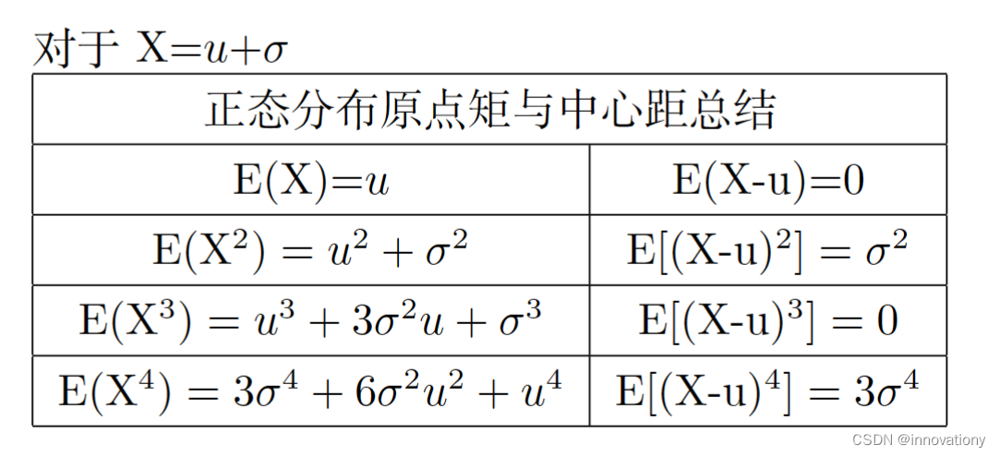

# 第2章 随机变量及其概率分布

## 2.3 连续型随机变量

### 2.3.2 常用连续型随机变量

#### （3）正态分布

正态分布的密度函数
$$
f(x)=\frac{1}{\sqrt{2 \pi \sigma^2}} e^{-\frac{(x-\mu)^2}{2 \sigma^2}} \quad x \in (-\infty,\infty)
$$
特别地，标准正态分布的密度函数和分布函数记为 $\varphi(x)$ 和 $\varPhi(x)$

**正态分布 k阶原点矩公式**

有两种方法算，一种是直接算，还有一种是先推导矩母函数，然后用矩母函数算

[直接算](https://blog.csdn.net/qq_41009742/article/details/90318171) ：

今天在看 $\chi^2$ 分布，计算其方差时，遇到了标准正态分布的四阶原点矩。书上直接写 $E\left(X_i^4\right)=3$ ，很好奇。设 $X_i \sim N(0,1)$ 想根据定义计算:
$$
E\left(X_i^4\right)=\int_{-\infty}^{+\infty} x^4 \frac{1}{\sqrt{2 \pi}} e^{-\frac{x^2}{2}} d x
$$

计算起来复杂度有点高，K阶就更不敢想。
想着估计结果是 $k$ 的递推关系式。所有直接计算:
$$
\begin{aligned}
E\left(X^k\right) & =\int_{-\infty}^{+\infty} x^k \frac{1}{\sqrt{2 \pi}} e^{-\frac{x^2}{2}} d x \\
& =\left.\frac{1}{k+1} x^{k+1} \frac{1}{\sqrt{2 \pi}} e^{-\frac{x^2}{2}}\right|_{-\infty} ^{+\infty}+\frac{1}{k+1} \int_{-\infty}^{+\infty} x^{k+2} \frac{1}{\sqrt{2 \pi}} e^{-\frac{x^2}{2}} d x \\
& =0+\frac{1}{k+1} E\left(X^{k+2}\right)
\end{aligned}
$$

从上式看，结果已经很明显了，其递推关系为：

$$
E\left(X^k\right)=(k-1) E\left(X^{k-2}\right), \quad k=2,3,4 \cdots
$$

其中:

$$
\begin{gathered}
E\left(X^0\right)=\int_{-\infty}^{+\infty} x^0 \frac{1}{\sqrt{2 \pi}} e^{-\frac{x^2}{2}} d x=1 \\
E\left(X^1\right)=0
\end{gathered}
$$
所以，当 $k=2 i$ 为偶数时:

$$
\begin{aligned}
E\left(X^k\right) & =(k-1)(k-3) \cdots 3 \times 1 \times E\left(X^0\right) \\
& =\prod_{i=1}^{k / 2}(2 i-1)
\end{aligned}
$$

当 $k=2 i-1$ 为奇数时:

$$
\begin{aligned}
E\left(X^k\right) & =(k-1)(k-3) \cdots 3 \times 1 \times E\left(X^1\right) \\
& =0
\end{aligned}
$$

综上有（即奇数阶乘）:

$$
E\left(X^k\right)= \begin{cases}\prod_{i=1}^{k / 2}(2 i-1) & k=2 i, i=1,2,3 \cdots \\ 0 & k=2 i-1\end{cases}
$$

矩母函数MGF

The Moment Generating Function $\phi(t)$ of the random variable $X$ is defined for all values $t$ by
$$
\phi(t)=\mathrm{E}\left(e^{t X}\right)
$$

Important Fact: There is a one-to-one correspondence between the moment generating function for a r.v. and its probability distribution (pmf or pdf).

$$
\begin{aligned}
& \text { Example: } X \sim N\left(\mu, \sigma^2\right): f_X(x)=\frac{1}{\sqrt{2 \pi \sigma^2}} e^{-(x-\mu)^2 / 2 \sigma^2} \\
& \qquad \begin{aligned}
& \phi_X(t)=\mathrm{E}\left(e^{t X}\right)=\int_{-\infty}^{\infty} \frac{1}{\sqrt{2 \pi \sigma^2}} e^{-(x-\mu)^2 / 2 \sigma^2} e^{t x} d x \\
= & \int_{-\infty}^{\infty} \frac{1}{\sqrt{2 \pi \sigma^2}} e^{- \left(x^2-2 \mu x-2 \sigma^2 t x+\mu^2\right) / 2 \sigma^2} d x \\
= & e^{t \mu+t^2 \sigma^2 / 2} \int_{-\infty}^{\infty} \frac{1}{\sqrt{2 \pi \sigma^2}} e^{-\frac{\left(x-\left(\mu+t \sigma^2\right)\right)^2}{2 \sigma^2}} d x \\
= & e^{t \mu+t^2 \sigma^2 / 2}
\end{aligned}
\end{aligned}
$$
We call $\phi(t)$ the moment generating function because all of the moments of $X$ can be obtained by successively differentiating $\phi(t)$ :

$$
\phi^{\prime}(0)=\mathrm{E}(X) \quad \phi^{\prime \prime}(0)=\mathrm{E}\left(X^2\right) \quad \phi^n(0)=\mathrm{E}\left(X^n\right), n \geq 1
$$

Example: $X \sim N\left(\mu, \sigma^2\right) \Rightarrow \phi(t)=e^{t \mu+t^2 \sigma^2 / 2}$

$$
\begin{aligned}
& \phi^{\prime}(t)=\left(\mu+t \sigma^2\right) e^{t \mu+t^2 \sigma^2 / 2} \\
& \phi^{\prime \prime}(t)=\left(\mu+t \sigma^2\right)^2 e^{t \mu+t^2 \sigma^2 / 2}+\sigma^2 e^{t \mu+t^2 \sigma^2 / 2}
\end{aligned}
$$

Therefore, we have
- $\mathrm{E}(X)=\phi^{\prime}(0)=\mu$
- $\mathrm{E}\left(X^2\right)=\phi^{\prime \prime}(0)=\mu^2+\sigma^2$
- $\operatorname{VAR}(X)=\mathrm{E}\left(X^2\right)-(\mathrm{E}(X))^2=\sigma^2$