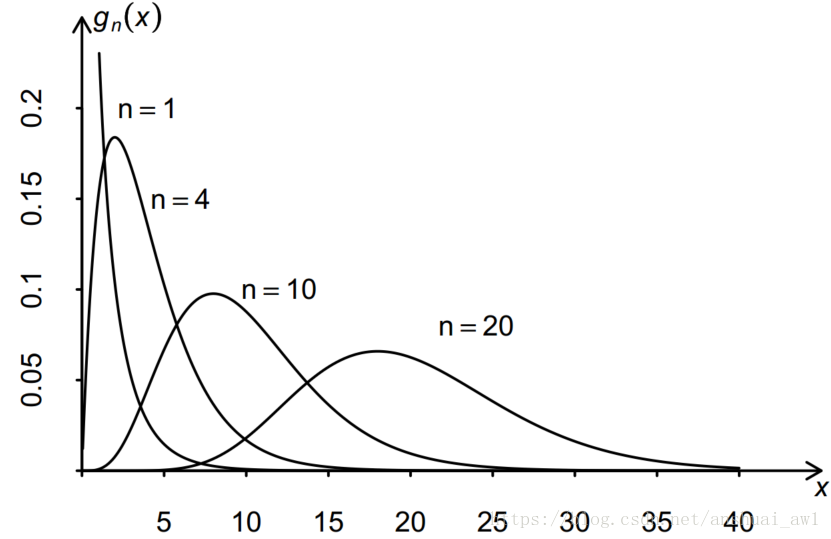

# 第6章 统计量与抽样分布

例6.3 设 $X_1,X_2,\cdots,X_n$ 为来自均值为 $\mu$ ，方差为 $\sigma^2$ 的总体的一组样本，则当 $n$ 充分大时，根据中心极限定理，有
$$
\frac{\Sigma_{i=1}^{n} X_i-n \mu }{\sqrt{n} \sigma} \rightarrow N(0,1)
$$
于是我们近似地有
$$
\bar{X} \sim N(\mu,\frac{\sigma^2}{n}) 
$$
上例表明，不管总体分布如何，样本均值 $\bar{X}$ 近似地服从均值为 $\mu$ ,方差为 $\frac{\sigma^2}{n}$ 的正态分布，这在实际应用中是非常方便的。

### 

## 6.3 正态总体

### 一、$\chi^2$ 分布

### 二、t分布

设 $X\sim N(0,1), Y \sim \chi^2(n)$， 且 $X$ 与 $Y$ 相互独立，则称随机变量
$$
T=\frac{X}{\sqrt{Y/n}}
$$
为服从自由度为 $n$ 的 t 分布，记为 $T\sim t(n)$​

t分布的极限分布是标准正态分布 $N(0,1)$​

### 四、上 $\alpha$​ 分位点

定义6.5 设 $X$ 是一个随机变量，对于一个给定的 $\alpha \in (0,1)$，称满足条件
$$
P(X>\lambda_{\alpha})=\alpha
$$
的实数 $\lambda_{\alpha}$ 为 $X$ 的上 $\alpha$ 分位点

### 五、正态总体的样本均值与样本方差的分布

定理6.2 $X_1，X_2, \cdots, X_n$ 来自$N(\mu,\sigma^2)$，则

(1) $\bar{X} \sim N(\mu,\frac{\sigma^2}{n})$

(2)$\frac{(n-1)S^2}{\sigma^2} \sim \chi^2(n-1)$

(3) $\bar{X}$ 与 $S^2$​ 相互独立

